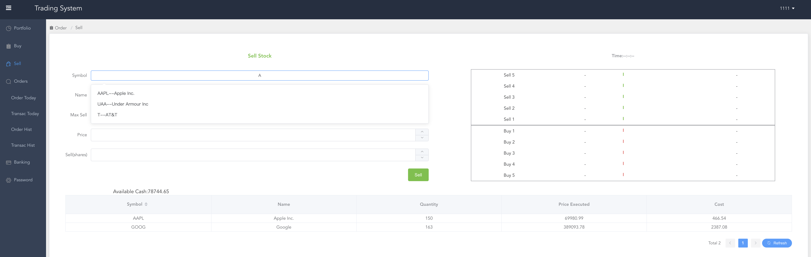
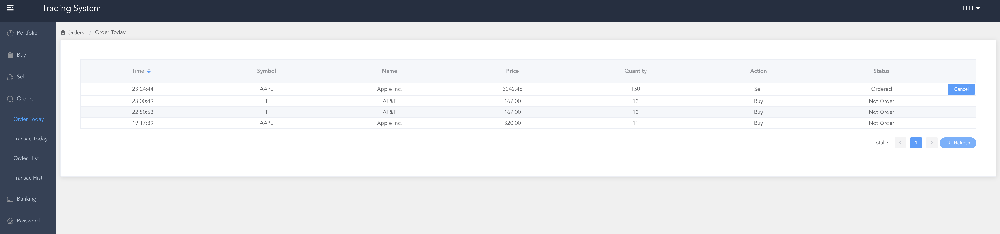
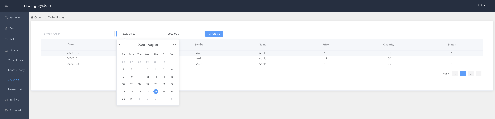

# Order Matching Trading System
---

> GitHub [@Alex Chen](https://github.com/chen-star) &nbsp;&middot;&nbsp;

---
## Overview

#### What is Matching Orders?

If one investor wants to buy a quantity of stock and another wants to sell the same quantity at the same price, their orders match and a transaction is made. 

Generally, a buy order and a sell order are compatible if the maximum price of the buy order matches or exceeds the minimum price of the sell order. 

#### Algorithm for Matching Orders

I adopted FIFO algorithm (**price-time-quantity** priority based) -  the earliest active buy order at the highest price takes priority over any subsequent order at that price, which in turn takes priority over any active buy order at a lower price. 

Example:

~~~
---------------------------------------------------
OrderId Direction	Price		Time	Quantity

1		  Sell			100			1			50  
2		  Sell			90			1			60  
3		  Buy			91			3			80
---------------------------------------------------

For the buyer's order 3, we first match the price 91 >= 90 (lowest now), and quantity 80 >= 60. The seller 2 managed to sell all the stocks in hand. But the price 91 < 100, the order 3 will not match order 1. The status after matching will be

---------------------------------------------------
OrderId Direction	Price		Time	Quantity

1		  Sell			100			1			50  
3		  Buy			91			3			20
---------------------------------------------------

~~~

### Demo

Sell Stock

Order Today

Order History

## Architecture

~~~

     Seller/Buyer

          +
          |
          | 1 - place order
          |
          |
  +-------v-------+
  |               |  
  |  API Gateway  |
  |               |             
  +---------------+
          |
          | 2
          |
          |
  +-------v-------+
  |               |      3      +--------------------+           6
  | Order Service +------------->   orders queue     +----------------------+
  |               |             +---------+----------+                      |
  +---------------+                       |                                 |
          | 4                             |5                                |
          |                               |                                 |
     +----v-----+                         |                                 |
     |          |               +---------v----------+            +---------v----------+
     | Database |          7    |                    |   8        |                    |
     |          <---------------+  Trading Service   +------------>  Trading Service   |
     +----------+               |  (order+matching)  |            |  (order+matching)  |
                                |                    |            |      Standby       |
                                |                    |            |                    |
                                +--------------------+            +--------------------+
                                          |
                                          |
                                          |
                                          |
                                          v
                                 Outside Stock Market
~~~                                

## User Interface

**Based on Vue.js**

* Implmented
	
	- User Login / Logout
	- Password Setting
	- Nav Bar
	- Side Bar
	- Banking 
	- Orders
	- Transactions
	- Buy / Sell

* Libs & Tools

	- **Electron**: Build cross-platform desktop App with JavaScript
	- **Element UI**: Common UI elements
	- **Vue Bus**: Component communication

## Order Service

**Based on Spring Core + Spring Boot + Spring Cloud**

* DB - Sqlite (For simplility + Fast Development)

* Redis + Docker (Caching)

	- `docker run --name redis-lab -p 6379:6379 -d redis`

* Uuid Generation

	- Twitter snowflake

	~~~
	64 bit in total ==> long in Java
	
	* 1 bit - sign bit (0 - positive, 1 - negative)
	* 41 bit - timestamp diff (current timestamp - start timestamp)
	* 10 bit - 5 for data center id + 5 for machine(worker) id
	* 12 bit - seq id in a milisecond unit ( 2 ^ 12 = 4096 ids in a ms)
	~~~
	
		Pro:
				- Seq id increase along with time
				- No duplicate id globally
				- Can generate a large number of ids per unit time

* Invert Index
    - Fast Form Auto completion for Stock Symbol

* Logic

~~~

					                                |----------- Stock Market Info
					                                |
Matching System ------------->------------------<------------ Order Status Info
						publish		                  consume								
									Vertx Event Bus
~~~
    

## Gateway

#### Reactor Pattern 

~~~

        Client
          +
          |
          | 1 - place order
          |
          |
  +-------v-------+
  |               |  
  |  Acceptor     |
  | NIOEventLoop  |
  |               |             
  +---------------+
          |
          | 2
          |
          |
  +-------v-------+
  |               |-----------------> Read  
  |      I/O      |
  |  NIOEventLoop |-----------------> Decode / Compute / Encode
  |               |
  |               |-----------------> Write
  +---------------+                        
                                
~~~      

Server: decode, handle datagram

Clent: generate datagram, send out datagram

## Raft Queue

* Queue cluster:

	- Fetch orders from Gateway
	- Sort orders by timestamp, price placed, quantity
	- Broadcast orders to matching system

* Why Raft

	- High Avaiblility - self-healing

* How to multicast to downstream

	- Vert.x datagram socket sends UDP packets
	- Why UDP: no connection overhead
	
	- How to solve package loss - use packet number to identify sequence. 
		- if SeqNo > lastSeqNo + 1, packet dropped, downstream asks for resend. 
		- of SeqNo < lastSeqNo + 1, packet duplicate, discard current packet/

		
## Matching Engine

* **Core Logic**

~~~
For each sine stock:
	Map<Price, PriorityQueue<Order>> sell
	Map<Price, PriorityQueue<Order>> buy

Case 1 - A buy order comes in
Get the queue<Order> with lowest price >= buy price
Poll out the first Order
	- If Partial Order of Buy, put buy order into buy queue
	- If Partial Order of Sell, put back sell order
	- If Buy order has taken all first sell order, poll out the second order, repeat...

Case 2 - A sell order comes in
Get the queue<Order> with highest price <= sell price
Poll out the first Order
	- If Partial Order of Sell, put sell order into sell queue
	- If Partial Order of Buy, put back buy order
	- If Sell order has taken all first buy order, poll out the second order, repeat...

~~~

* **Ring Buffer** 

~~~
        Producer
          |
          | 
          | Order
          |         
  +-------v-------+
  |               |
  |               |
  |  Ring Buffer  |<----------- Consumer -----------> Order Service (Counter)
  |               |            (Pre-Check, Matching, Publish Matching to outside Stock Market)
  |               |
  |               |
  +---------------+   
~~~

